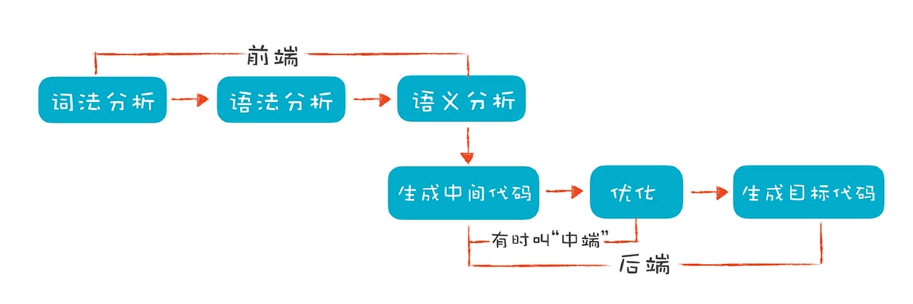

== 概述
*编译原理* +
是对高级程序语言进行翻译的一门科学技术, 我们都知道计算机程序由程序语言编写而成, 在早期计算机程序语言发展较为缓慢, 因为计算机存储的数据和执行的程序都是由0、1代码组合而成的, 那么在早期程序员编写计算机程序时必须十分了解计算机的底层指令代码通过将这些微程序指令组合排列从而完成一个特定功能的程序, 这就对程序员的要求非常高了。人们一直在研究如何如何高效的开发计算机程序, 使编程的门槛降低。

*编译原理的过程*

