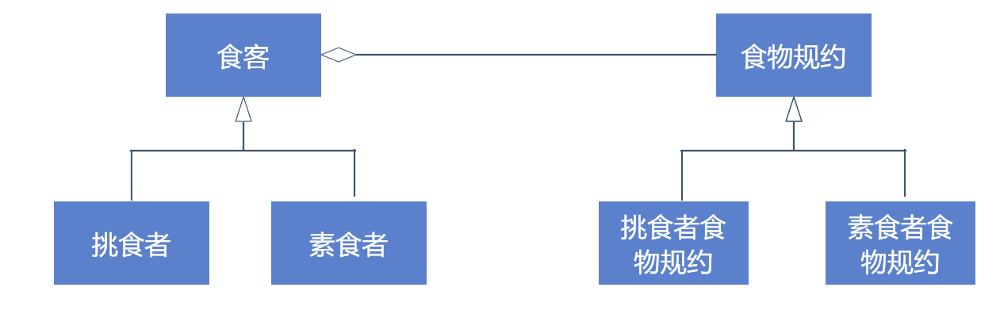

== 什么是规约模式（Specification pattern）
假设你正在减肥，不能吃肉，也不能吃卡路里大于500的食物。用编程来表示这种情况就会是下面这样

----
void Eat(Food food)
{
    if(food.HasMeat||food.Calorie>500)
    {
        Console.WriteLine("不吃");
        return;
    }
    Console.WriteLine("吃");
}
----
[%hardbreaks]
很简单的卫语句搞定。
但是如果你是一个挑食者，你不吃鱼，虾，鸡蛋，牛奶等等，那上述的卫语句就会变得无比之长。
这时候我们就会想着把它抽取成一个单独的返回布尔值的方法。
当然现在只是结构上的抽取，还不能算是模式。
但是如果现在的用例是给所有类型的同学配餐，那这个方法就可以抽成可复用接口，形成模式。

=== 定义
在wiki中，对规约模式（Specification pattern）的定义是 a particular software design pattern, whereby business rules can be recombined by chaining the business rules together using boolean logic.

具体就是指将业务规则用布尔运算组合起来的一种设计模式。

=== 规约模式优势
规约模式的优势在于将业务逻辑从隐式（包含在某个方法中的卫语句），变成显式规则（提取成单独的类型）。

这种方法能够很明确的告诉开发者（尤其是后续的代码维护者），这个逻辑是一个特定的领域知识，提示开发者能够复用、检验和调整这些领域知识。（因此在DDD中规约模式很常见）

另外也有利于实现控制反转，将领域规则从实体对象或者服务内部，抽取到外部。

比如现在新来了一个不吃辣的同学，我们只需要新增一条不辣食物的规约，进行注入，而不需要深入食客对象进行更改。

=== 规约模式和策略模式对比
规约模式和我们熟知的策略模式会很像。他们的共同点有：

1. 封装了一组业务规则（领域知识）
2. 由统一的接口
3. 各个策略/规约可以相互替换

但是也有以下以下不同：

1. 策略模式不限定返回值，而规约模式只能是布尔值
2. 不同的规约可以通过布尔运算组成新的规约，策略模式未定义这种行为

所以我们可以简单的认为规约模式是一种特殊的策略模式。

=== 规约模式劣势
规约模式也很容易遭到滥用，部分同学学习了规约模式后，就会想将所有的卫语句都提取成规约。

事实上这种方式会导致代码的复杂度增加，而有些领域知识如果是稳定的（不变的），那么放在实体类型中往往会更加合适。

== 参考
[%hardbreaks]
https://xinyuehtx.github.io/post/specification%E6%A8%A1%E5%BC%8F.html[今天和大家介绍一下一种特殊的设计模式——规约模式（Specification pattern）]
https://www.cnblogs.com/youring2/p/Specification-Pattern.html[设计模式：规约模式（Specification-Pattern） - 拓荒者-NET - 博客园]
https://www.kancloud.cn/sstd521/design/193648[38.1　规格模式 · 设计模式之禅（第2版） · 看云]
https://en.wikipedia.org/wiki/Specification_pattern[Specification pattern - Wikipedia]
https://zh.wikipedia.org/wiki/%E5%8D%AB%E8%AF%AD%E5%8F%A5[卫语句 - 维基百科，自由的百科全书]
https://zh.wikipedia.org/wiki/%E7%AD%96%E7%95%A5%E6%A8%A1%E5%BC%8F[策略模式 - 维基百科，自由的百科全书]