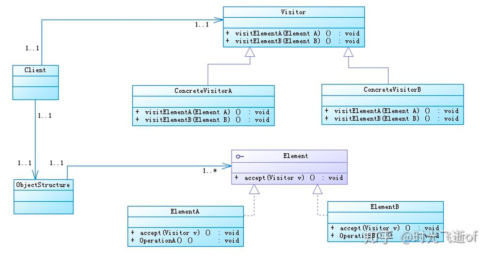

== 简介
[%hardbreaks]
涉及的角色
（1）Visitor：接口或者抽象类，它定义了对每一个元素（Element）访问的行为，它的参数就是可以访问的元素，它的方法数理论上来讲与元素个数是一样的，因此，访问者模式要求元素的类族要稳定，如果经常添加、移除元素类，必然会导致频繁地修改Visitor接口，如果这样则不适合使用访问者模式。
（2）ConcreteVisitor1、ConcreteVisitor2：具体的访问类，它需要给出对每一个元素类访问时所产生的具体行为。
（3）Element：元素接口或者抽象类，它定义了一个接受访问者的方法（Accept），其意义是指每一个元素都要可以被访问者访问。
（4）ConcreteElementA、ConcreteElementB：具体的元素类，它提供接受访问方法的具体实现，而这个具体的实现，通常情况下是使用访问者提供的访问该元素类的方法。
（5）ObjectStructure：定义当中所说的对象结构，对象结构是一个抽象表述，它内部管理了元素集合，并且可以迭代这些元素供访问者访问。

== 优缺点
【约束】要求元素类型是稳定不易变化的，因为元素类型的变化会导致所有访问者类型都要变化； +
【优点】增加访问者类型非常容易，且不容易造成其他影响（所有的调用关系与其他已有的访问者相同），只是在初始调用的地方，将访问者替换为新增加的访问者即完成了全部工作。

== 适用场景
. 一个数据结构如(List.Set/Map等)包含很多类型对象
. 数据结构与数据操作分离

== 参考
[%hardbreaks]
https://zhuanlan.zhihu.com/p/35182323[设计模式----访问者模式]
https://refactoringguru.cn/design-patterns/visitor[访问者模式]
https://www.jianshu.com/p/7db0c2266263[源码解读 | Spring | 占位符 placeholder 的实现原理]
