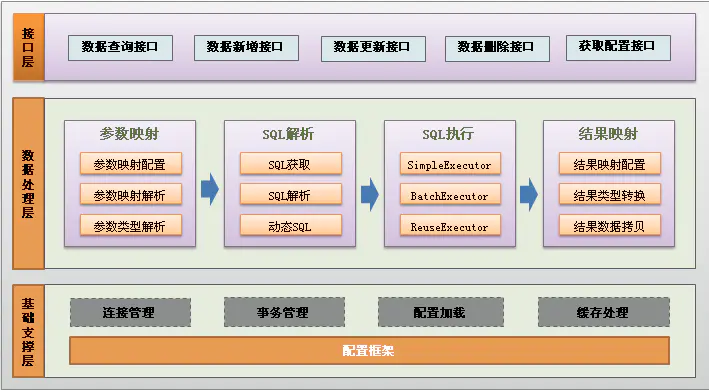

# 架构图

# 参考
[Introduction to MyBatis](https://zetcode.com/db/mybatis/)  
[MyBatis3 源码解析 - MyBatis3 整体架构](https://www.jianshu.com/p/a341bae7fcfc)  
[手把手带你阅读Mybatis源码（一）构造篇](https://www.cnblogs.com/javazhiyin/p/12340498.html)  