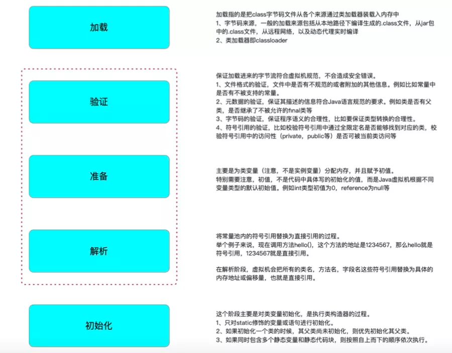

# 简介
>classloader顾名思义，即是类加载。虚拟机把描述类的数据从class字节码文件加载到内存，并对数据进行检验、转换解析和初始化，最终形成可以被虚拟机直接使用的Java类型，这就是虚拟机的类加载机制。  

classLoader 的作用是将 class 的字节码加载到虚拟机中，其过程一般为：  
加载 &rarr; (验证 &rarr; 准备 &rarr; 解析)  &rarr;初始化  
> 为了方便记忆，我们可以使用一句话来表达其加载的整个过程，“家宴准备了西式菜”，即家(加载)宴(验证)准备(准备)了西(解析)式(初始化)菜。

JVM 提供给开发者可以干预的环节主要是 **加载** 环节

# 双亲委派模型

**解决问题**
* 重复类的加载问题
* 核心类的安全问题

**classloader 种类**  
1. 启动类加载器(Bootstrap Classloader)  
   负责将<JAVA_HOME>/lib目录下并且被虚拟机识别的类库加载到虚拟机内存中。  
   我们常用基础库，例如java.util.**，java.io.**，java.lang.**等等都是由根加载器加载。
2. 扩展类加载器(Extension Classloader)
   负责加载JVM扩展类，比如swing系列、内置的js引擎、xml解析器等，这些类库以javax开头，它们的jar包位于<JAVA_HOME>/lib/ext目录中。  
3. 应用程序加载器(Application Classloader)  
   也叫*系统类加载器*，它负责加载用户路径(ClassPath)上所指定的类库。  
   我们自己编写的代码以及使用的第三方的jar包都是由它来加载的。  
4. 自定义加载器(Custom Classloader)  
   通常是我们为了某些特殊目的实现的自定义加载器，后面我们得会详细介绍到它的作用以及使用场景。
   
**代码实现**
  

## 双亲委派模型反例

# 参考
[Java类加载器 — classloader 的原理及应用](https://mp.weixin.qq.com/s?__biz=MzAxNDEwNjk5OQ==&mid=2650418560&idx=1&sn=ed3c3ee4184fe48ffdcfb88d6b2aa539&chksm=8396e598b4e16c8ee4d4908d94cc41ed9d183538522b0b14524ec5bdf995e3197b88f70ff0c6&scene=178&cur_album_id=1452661944472977409#rd)  
[一看你就懂，超详细java中的ClassLoader详解](https://blog.csdn.net/briblue/article/details/54973413)  
