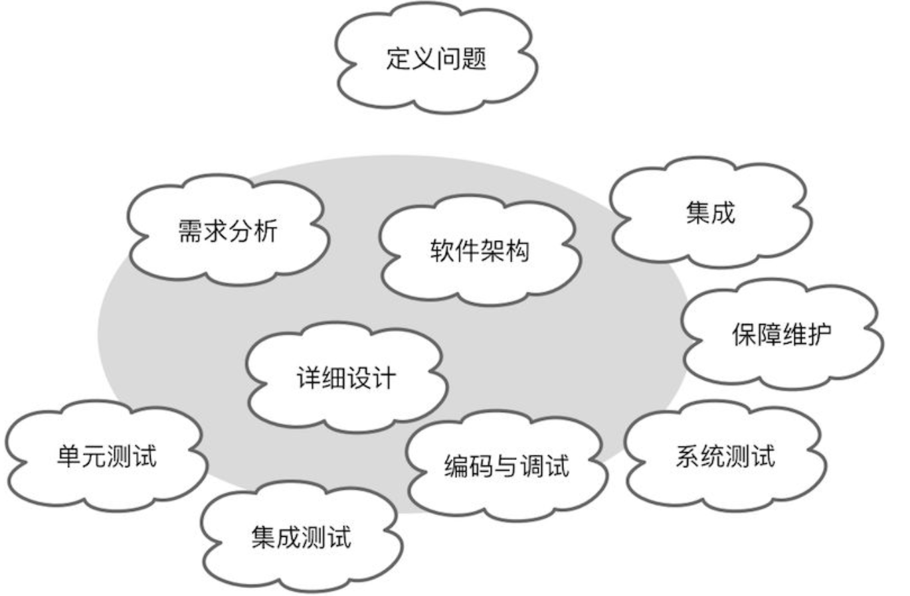

. 模型是解决此类信息超载问题的工具。模型这种知识形式对知识进行了选择性的**简化**和有意的**结构化**。
. 利用**抽象**化繁为简，通过**标准的结构**来组织和传递信息，形成一致的可以进行推演的**解决方案**，这就是“模型”。

建模：模型的重要性并不体现在它的表现形式，而在于它传递的**知识**。它是从需求到编码实现的知识翻译器，通过它对杂乱无章的问题进行梳理，消除无关逻辑乃至次要逻辑的噪音，然后再按照知识语义进行归纳与分类，并遵循设计标准与规范建立一个清晰表达业务需求的结构。这个**梳理、归纳与分类**的过程就是建模的过程，建立的结构即为模型。

建模活动用灰色的椭圆表示，它主要包括需求分析、软件架构、详细设计和编码与调试等活动，有时候，测试、集成与保障维护活动也会在一定程度上影响系统的建模。为了便于更好地理解建模过程，我将整个建模过程中主要开展的活动称之为“建模活动”，并统一归纳为分析活动、设计活动与实现活动。每一次建模活动都是对知识的一次提炼和转换，产出的成果就是各个建模活动的模型： +
• [.underline]#分析活动#：观察现实世界的业务需求，依据设计者的建模观点对业务知识进行提炼与转换，形成表达了[.underline]##业务规则、业务流程或业务关系##的逻辑概念，建立分析模型。 +
• [.underline]#设计活动#：运用软件设计方法进一步提炼与转换分析模型中的逻辑概念，建立设计模型，使得模型在满足需求功能的同时满足更高的设计质量。 +
• [.underline]#实现活动#：通过编码对设计模型中的概念进行提炼与转换，建立实现模型，构建可以运行的高质量软件，同时满足未来的需求变更与产品维护。 +

== 参考
https://developer.aliyun.com/article/1153910[软件系统中的模型]