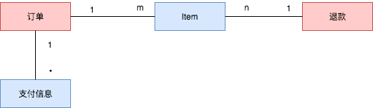
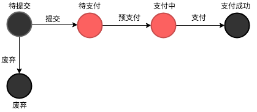
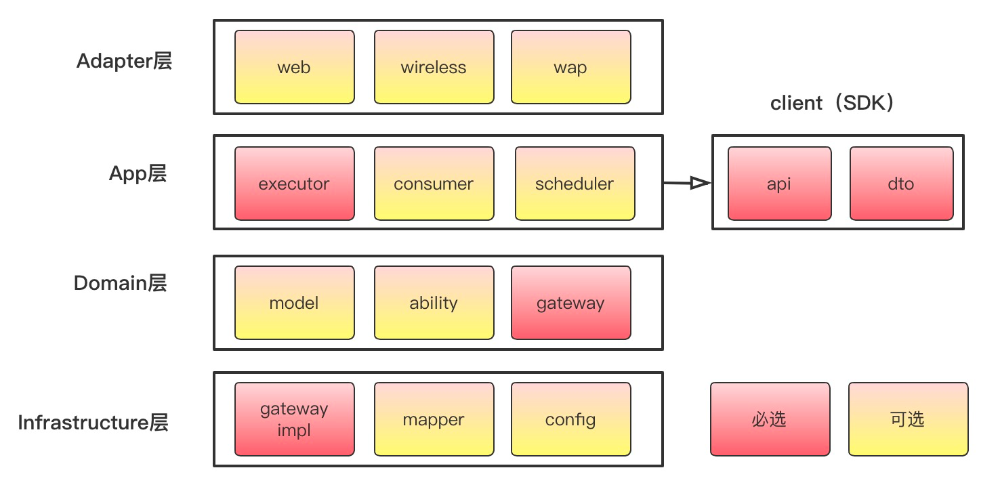

# 背景
## 建模 VS 功能堆积

### 功能堆积（战术编程）

### 建模设计（战略编程）

# 建模步骤
* **找出业务主流程**  
* **细分业务主流程**  
* **抽象**

## 从需求到模型
1. **明确系统定位，确定领域边界**  
  项目初期就应该将系统的目标和定位搞清楚（职能可以使用一句话描述出来） 
2. **明确领域概念，实体，明确领域内划分**
  * 知识提取：从需求中挖掘 角色、实体、动作和约束  
    名词 &rarr; 角色，实体（实体比角色出现的次数更多）  
    动词 &rarr; 动词  
    **约束 &rarr; 规则** 约束分为隐式约束和显示约束，除了作为业务卡控规则外，还用来确认实体之间的关系。
  * 知识聚合：将 角色、实体、动作和约束 关联起来：*什么角色，可以使用什么行为，操作什么实体*   
  * 领域划分
    * 划分标准：关联性（耦合性）
    * 划分实践：按流程的时间线，纵向划分；并行执行的流程，横向划分；
    * 领域的复杂度演进：开发人员的数量多可能意味着系统需要再次拆分！ 
      >康威定律：一个组织的系统通常被设计成这个组织通信结构的副本
3. **明确领域模型，状态流转**  
   <u>注意：领域模型不是严格的实体关系，只是说明围绕在核心领域周围的实体以及关系是什么</u>
   
   
   
## 从模型到代码
模型只是系统的粗略、大概的划分，系统在实现时应该按照模型进行实现，补充细节（具体的字段、上下游接口等），即：**模型应该指导编码，编码应该实现模型**！  
### 代码分层
1. **DDD （COLA 分层）**
  
* 接口层
* 应用层
* 领域层
* 基础设施层

# 参考
[换个思维学领域建模方法和实践_InfoQ_高福来](https://www.infoq.cn/article/6hpbsmxqngx_eapkuuws)  
[系统架构系列（一）：如何用公式定义该概念？_InfoQ_高福来](https://www.infoq.cn/article/fwhQ-dIN2xTUH6zNLYZp)  
[27 | 领域驱动设计：如何从零开始设计一个软件？_软件设计之美_极客时间](https://time.geekbang.org/column/article/266819)    
[程序猿和架构师都应该了解“康威定律”(Conway's law)](https://juejin.cn/post/6844904054942859271)  
