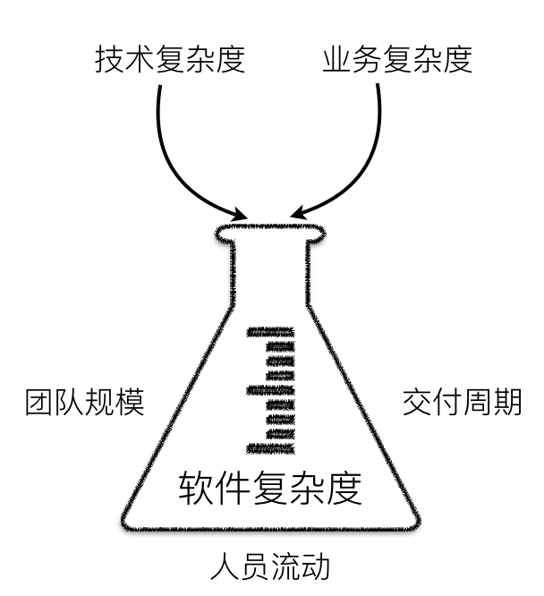

== 复杂度
复杂的来源：可理解性、可预测性 +
影响因素： 规模、结构和变化

* 问题域过于庞大而复杂，使得从问题域中寻求解决方案的挑战增加，该问题与软件系统的规模有关。
* 开发人员将业务逻辑的复杂度与技术实现的复杂度混淆在一起，该问题与软件系统的结构有关。
* 随着需求的增长和变化，无法控制业务复杂度和技术复杂度，该问题与软件系统的变化有关。

需求复杂性：

* 技术复杂性：质量属性，例如安全、性能、并发、可用性
* 业务复杂性：规模（需求复杂性是持续增加的）、功能增加后功能之间的依赖和影响、质量属性（可扩展性、可维护性）等

解决复杂和大规模软件的武器可以被粗略地归为三类：抽象、分治和知识。

* 分治 把问题空间分割为规模更小且易于处理的若干子问题。分割后的问题需要足够小，以便一个人单枪匹马就能够解决他们；其次，必须考虑如何将分割后的各个部分装配为整体。分割得越合理越易于理解，在装配成整体时，所需跟踪的细节也就越少。即更容易设计各部分的协作方式。评判什么是分治得好，即高内聚低耦合。

* 抽象 使用抽象能够精简问题空间，而且问题越小越容易理解。举个例子，从北京到上海出差，可以先理解为使用交通工具前往，但不需要一开始就想清楚到底是高铁还是飞机，以及乘坐他们需要注意什么。

* 知识 顾名思义，DDD可以认为是知识的一种。 DDD提供了这样的知识手段，让我们知道如何抽象出限界上下文以及如何去分治。

'''

* 分而治之、控制规模 +
Unix 的这种设计哲学被 Doug McIlroy、Elliot Pinson 和 Berk Tague 总结为以下两条： +
** Make each program do one thing well. To do a new job, build a fresh rather than complicate old programs by adding new “features.” +
** Expect the output of every program to become the input to another, as yet unknown, program. +
** 这两条原则是相辅相成的。第一条原则要求一个程序只做一件事情，符合“单一职责原则”，在应对新需求时，不会直接去修改一个复杂的旧系统，而是通过添加新特性，然后对这些特性进行组合。要满足小程序之间的自由组合，就需要满足第二条原则，即每个程序的输入和输出都是统一的，因而形成一个统一接口（Uniform Interface），以支持程序之间的自由组合（Composability）。利用统一接口，既能够解耦每个程序，又能够组合这些程序，还提高了这些小程序的重用性，这种“统一接口”，其实就是架构一致性的体现。
* 保持结构的清晰与一致 +
合理地进行职责分配，良好的封装与抽象，并在约束的指导下为架构建立 *一致* 的风格，这是许多良好系统的设计特征。
* 拥抱变化 +
** 可进化性（Evolvability）
** 可扩展性（Extensibility）
** 可定制性（Customizability）

子模块的复杂度cp是一个经验值，它关注几个现象：

* 修改扩散，修改时有连锁反应。
* 认知负担，开发人员需要多长时间来理解功能模块。
* 不可知（Unknown Unknowns），开发人员在接到任务时，不知道从哪里入手。

造成复杂的原因一般是代码依赖和晦涩(Obscurity)。其中，依赖是指某部分代码不能被独立地修改和理解，必定会牵涉到其他代码。代码晦涩，是指从代码中难以找到重要信息。

== 参考
[%hardbreaks]
https://tech.meituan.com/2019/09/19/common-method-of-reduce-complexity.html[降低软件复杂性一般原则和方法]
https://mp.weixin.qq.com/s/pdjlf9I73sXDr30t-5KewA[阿里高级技术专家方法论：如何写复杂业务代码？]
http://learn.lianglianglee.com/%E4%B8%93%E6%A0%8F/%E9%A2%86%E5%9F%9F%E9%A9%B1%E5%8A%A8%E8%AE%BE%E8%AE%A1%E5%AE%9E%E8%B7%B5%EF%BC%88%E5%AE%8C%EF%BC%89/004%20%E6%B7%B1%E5%85%A5%E5%88%86%E6%9E%90%E8%BD%AF%E4%BB%B6%E7%9A%84%E5%A4%8D%E6%9D%82%E5%BA%A6.md[004 深入分析软件的复杂度]
