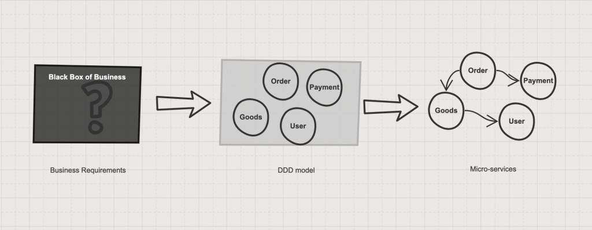

*科学的架构设计应该通过一些输入并逐步推导出结果*

对于服务拆分的逻辑来说，是 *先设计高内聚低耦合的领域模型，再实现相应的分布式系统。* 服务的划分有一些基本的方法和原则，通过这些方法能让微服务划分更有操作性。最终在微服务落地实施时也能按图索骥，无论是对遗留系统改造还是全新系统的架构都能游刃有余。

领域驱动设计立足于面向对象思想，从业务出发，通过领域模型的方式反映系统的抽象，从而得到合理的服务划分。

采用 DDD 来进行业务建模和服务拆分时，可以参考下面几个阶段： +

1. 使用 DDD（领域驱动建模） 进行业务建模，从业务中获取抽象的模型（例如订单、用户），根据模型的关系进行划分限界上下文。
2. 检验模型是否得到合适的的抽象，并能反映系统设计和响应业务变化。
3. 从 DDD 的限界上下文往微服务转化，并得到系统架构、API列表、集成方式等产出。

== 拆分的必要性
* *解耦业务，降低上下文理解难度，追求更合理的产品设计* +
多个业务概念耦合在一起，特别是架构上耦合比较紧密时，会产生一些不好的涌现物。业务代码在一起，数据存储在一起，实现层面可以很方便的查询或更新相关联的数据，这很容易产生实现驱动设计。以我们拆分的服务既有功能举个例子：库存零售上报日期既可以在订单上维护，也可以在库存上维护，直观的感觉这个业务概念的归属不清晰。可以看到，底层架构设计从某种程度上影响了上层的业务设计。 +
当产品开发周期较长，业务人员和开发人员不断更替，让项目上每个成员都具备完整的业务知识变的越来越难，在快速交付迭代过程中，追求业务价值和实现的简便通常在不断的取平衡，不合理的底层架构让这个天平产生了倾斜，为了低成本的完成某些产品功能导致了一些不合理的设计，逐渐产生的不合理设计从一定程度上增加了业务的复杂度，为产品后续的演进埋下了隐患，往往后面需要花费更多的成本来为这些隐患买单。
* *降低系统复杂度，提升开发效率* +
当代码量达到一定量级，这种业务耦合带来的上下文传递的复杂度会非常高，新上项目的同学需要消化理解的内容太多，很难快速上手，某种程度上降低了团队的效率。 +
另外，敏捷软件开发过程中，通常开发人员要写单元测试来保证代码的正确性，开发人员每次提交前需要在本地运行所有的测试，保证修改没有影响到既有的功能，而产品代码体量的增长会伴随着测试代码量的增长，本地执行测试的时间会越来越长，开发人员得到反馈的时间变长，在团队规模较大的情况下，反馈周期变长无疑会降低整个团队的开发效率。

* *提升项目整体质量* +
在日常开发中，每个功能都有很多种实现方式，不同的选择会产生不同的影响，给开发人员带来较大的挑战是如何能够在复杂的业务逻辑面前能够找到一个合适的实现方式，这需要开发人员对业务流程和价值有非常清晰的理解；但在实践中，特别是项目开发人员不断更替的情况下，这点是非常难做到的。 +
另外，业务概念生命周期不同会导致业务需求变化速率也不同，这也对产品质量产生了非常大的挑战。我们在每个迭代都会做BUG分析，最多的BUG类型是新代码破坏原有功能，我们尝试增加测试覆盖率已解决已有功能破坏的问题，但收效甚微，主要原因是业务复杂，一方面因为写更具业务价值的测试成本也非常高，成本很高，更重要的是很难将所有的组合场景都测全。

== 拆分的想法验证

== 使用DDD进行业务建模
通过利用DDD对系统从业务的角度分析，对系统进行抽象后，得到内聚更高的业务模型集合，在DDD中一组概念接近、高度内聚并能找到清晰的边界的业务模型被称作限界上下文（Bounded Context）。

限界上下文可以视为逻辑上的微服务，或者单体应用中的一个组件。在电商领域就是订单、商品以及支付等几个在电商领域最为常见的概念；在社交领域就是用户、群组、消息等。

== 参考
[%hardbreaks]
https://www.infoq.cn/article/xHmsStj6ShvFJwIo2z7T[微服务划分的模式与反模式]
https://insights.thoughtworks.cn/ddd-split-microservices/[用DDD指导微服务拆分]
https://insights.thoughtworks.cn/microservices-splitting/[迭代开发中的微服务拆分]
