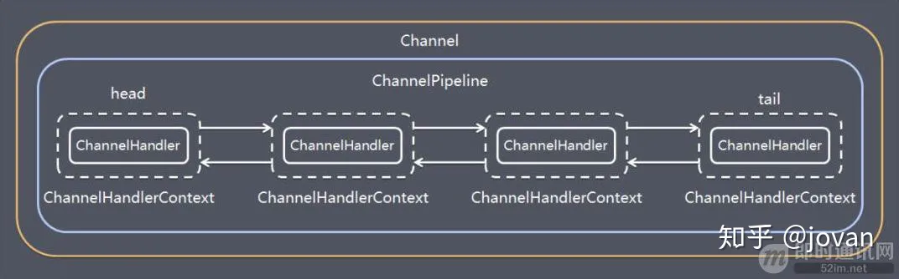

== 架构设计

Netty采用典型的三层网络架构进行开发和设计，主要涵盖Reactor通信调度层，责任链ChannelPipeline和业务逻辑编排层（Service ChannelHandler）。

Reactor通信调度层：该层主要包含NioSocketChannel(客户端异步非阻塞通道)/NioServerSocketChannel(服务端异步非阻塞通道)，Eventloop，ByteBuffer和Task。该层的主要职责是监听网络的读写和连接操作，负责将网络层的数据读取到内存缓冲区中，然后出发各种网络事件，例如连接，读/写等事件，将这些事件出发到pipeline中，由pipeline管理的职责链来进行后续处理。

职责链ChannelPipeline：它负责事件在职责链中的有序传播，同时负责动态地编排职责链。不同应用的Handler 节点的功能也不同，通常情况下，往往会开发编解码Hanlder 用于消息的编解码，它可以将外部的协议消息转换成内部的POJO 对象，这样上层业务则只需要关心处理业务逻辑即可，不需要感知底层的协议差异和线程模型差异，实现了架构层面的分层隔离。

业务逻辑编排层：业务逻辑编排层通常有两类：一类是纯粹的业务逻辑编排，还有一类是其他的应用层协议插件，用于特定协议相关的会话和链路管理。例如CMPP 协议，用于管理和中国移动短信系统的对接。

== 模块介绍

*1.Bootstrap，ServerBootstrap*

bootstrap意思是引导，一个Netty应用通常由一个Bootstrap开始，主要作用是配置整个netty程序，串联各个组件。ServerBootstrap是服务端启动引导类，Bootstrap是客户端启动引导类。

*2.Channel*

Channel是Netty网络通信的 *通道*，通过该通道可以执行网络I/O操作。主要作用是：

* 维护当前网络连接的通道的状态（例如是否打开？是否已连接？）
* 网络连接的配置参数（例如接收和发送缓冲区的大小）
* 提供异步的网络I/O操作（如建立连接，读写，绑定端口），异步意味着任何I/O操作都会立即返回，可以通过注册一个监听器来自定义操作结果的事件处理。
* 支持关联I/O操作与对应的处理程序

一些常用的Channel类型：
[%hardbreaks]
NioSocketChannel，异步的客户端 TCP Socket 连接。
NioServerSocketChannel，异步的服务器端 TCP Socket 连接。
NioDatagramChannel，异步的 UDP 连接。
NioSctpChannel，异步的客户端 Sctp 连接。
NioSctpServerChannel，异步的 Sctp 服务器端连接
这些通道涵盖了 UDP 和 TCP 网络 IO 以及文件 IO。

*3.Selector*

Netty 基于 Selector 对象实现 I/O 多路复用，通过 Selector 一个线程可以监听多个连接的 Channel 事件。

当向一个 Selector 中注册 Channel 后，Selector 内部的机制就可以自动不断地查询(Select) 这些注册的 Channel 是否有已就绪的 I/O 事件（例如可读，可写，网络连接完成等），这样程序就可以很简单地使用一个线程高效地管理多个 Channel 。

*4.NioEventLoop*

NioEventLoop中维护了一个线程和任务队列，支持异步提交执行任务，线程启动时会调用NioEventLoop的run方法，执行I/O任务和非I/O任务：

I/O任务，即selectionKey中就绪事件，例如read，write，accept，connect等，由processSelectedKeys方法触发。

非I/O任务，添加到taskQueue中的任务，如register()，bind()等任务

*5.NioEventLoopGroup*

NioEventLoopGroup，主要管理 eventLoop 的生命周期，可以理解为一个线程池，内部维护了一组线程，每个线程(NioEventLoop)负责处理多个 Channel 上的事件，而一个 Channel 只对应于一个线程。

*6.ChannelHandler*

它是一个接口，用于处理I/O事件或拦截I/O事件，并将其转发给对应的channelPipeline中的下一个处理程序。

ChannelHandler 本身并没有提供很多方法，因为这个接口有许多的方法需要实现，方便使用期间，可以继承它的子类：

____
ChannelInboundHandler 用于处理入站 I/O 事件。 +
ChannelOutboundHandler 用于处理出站 I/O 操作。 +
____

或者使用以下适配器类：

____
ChannelInboundHandlerAdapter 用于处理入站 I/O 事件。 +
ChannelOutboundHandlerAdapter 用于处理出站 I/O 操作。 +
ChannelDuplexHandler 用于处理入站和出站事件。 +
____

*7.ChannelHandlerContext*

保存Channel相关的上下文信息，同时关联一个ChannelHandler对象

*8.ChannelPipeline*

保存 ChannelHandler 的 List，用于处理或拦截 Channel 的入站事件和出站操作。

在 Netty 中每个 Channel 都有且仅有一个 ChannelPipeline 与之对应，它们的组成关系如下：

一个 Channel 包含了一个 ChannelPipeline，而 ChannelPipeline 中又维护了一个由 ChannelHandlerContext 组成的双向链表，并且每个 ChannelHandlerContext 中又关联着一个 ChannelHandler。

入站事件和出站事件在一个双向链表中，入站事件会从链表 head 往后传递到最后一个入站的 handler，出站事件会从链表 tail 往前传递到最前一个出站的 handler，两种类型的 handler 互不干扰。

== 参考
[%hardbreaks]
https://zhuanlan.zhihu.com/p/260472955[Netty原理与架构]
TODO https://www.toutiao.com/i6792175198767415811/[从 Spring Boot 程序启动深入理解 Netty 异步架构原理]
TODO https://mp.weixin.qq.com/s/GzvwZvVNHx4yjEUVibSNBA[在Netty服务被N次攻击之后，终于抓到现行了]
TODO https://www.toutiao.com/i6768337166788461068/[Netty架构原理，不怕你看不懂]
TODO https://www.toutiao.com/i6739473228365824526/[目前为止最透彻的的Netty高性能原理和框架架构解析]
TODO https://www.toutiao.com/i6754164257136312846/[使用Netty通信时，遇到TCP粘包拆包问题如何解决？答案如此简单]
TODO https://www.toutiao.com/i6851139621280023052/[Netty组件之Channel注册]
TODO https://www.cnblogs.com/niejunlei/p/13155554.html[Netty中的这些知识点，你需要知道]
TODO https://www.toutiao.com/i6837662776295424520/[Netty 中的内存分配浅析]
TODO https://www.cnblogs.com/niejunlei/p/13070107.html[不知道Netty，面试只能凉凉......]
TODO https://www.toutiao.com/i6833200311868326412/[简单了解Java Netty Reactor三种线程模型]
TODO https://www.toutiao.com/i6828428436210450947/[当Tomcat遇上Netty，我这一系列神操作，同事看了拍手叫绝]
TODO https://www.toutiao.com/i6831810790048137739/[JAVA NIO开发需要知道的Netty精粹]
TODO https://www.toutiao.com/i6776170564647125507/[支撑百万级并发，Netty如何实现高性能内存管理]
TODO https://www.toutiao.com/i6823921350340510211/[Netty 源码解析（六）: Channel 的 register 操作]
TODO https://www.toutiao.com/i6719023259674739208/[手写RPC框架(5)重写服务治理和引入netty，猜猜1000线程情况如何]
TODO https://www.toutiao.com/i6943237274205209095/[面试官：Netty的线程模型不是主从多Reactor这么简单]
