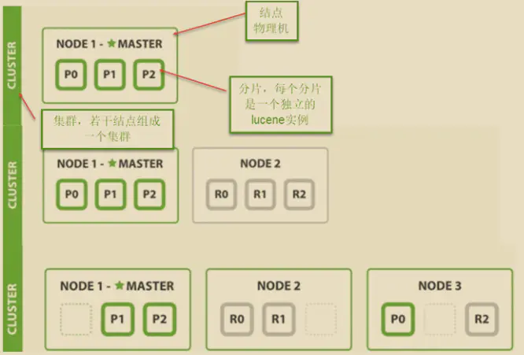

== 简介
全文搜索属于最常见的需求，开源的 Elasticsearch （以下简称 Elastic）是目前全文搜索引擎的首选。它可以快速地储存、搜索和分析海量数据。
维基百科、Stack Overflow、Github 都采用它。

Elastic 的底层是开源库 Lucene。但是，你没法直接用 Lucene，必须自己写代码去调用它的接口。Elastic 是 Lucene 的封装，提供了 REST API 的操作
接口，开箱即用。Elastic 的底层是开源库 Lucene。但是，你没法直接用 Lucene，必须自己写代码去调用它的接口。Elastic 是 Lucene 的封装，提供了
REST API 的操作接口，开箱即用。

|===
|SQL |Elasticsearch |Description

|column
|field
|In both cases, at the lowest level, data is stored in named entries, of a variety of data types, containing one value. SQL calls such an entry a column while Elasticsearch a field. Notice that in Elasticsearch a field can contain multiple values of the same type (essentially a list) while in SQL, a column can contain exactly one value of said type. Elasticsearch SQL will do its best to preserve the SQL semantic and, depending on the query, reject those that return fields with more than one value.

|row
|document
|Columns and fields do not exist by themselves; they are part of a row or a document. The two have slightly different semantics: a row tends to be strict (and have more enforcements) while a document tends to be a bit more flexible or loose (while still having a structure).

|table
|index
|The target against which queries, whether in SQL or Elasticsearch get executed against.

|schema
|implicit
|In RDBMS, schema is mainly a namespace of tables and typically used as a security boundary. Elasticsearch does not provide an equivalent concept for it. However when security is enabled, Elasticsearch automatically applies the security enforcement so that a role sees only the data it is allowed to (in SQL jargon, its schema).

|catalog or database
|cluster instance
|In SQL, catalog or database are used interchangeably and represent a set of schemas that is, a number of tables. In Elasticsearch the set of indices available are grouped in a cluster. The semantics also differ a bit; a database is essentially yet another namespace (which can have some implications on the way data is stored) while an Elasticsearch cluster is a runtime instance, or rather a set of at least one Elasticsearch instance (typically running distributed). In practice this means that while in SQL one can potentially have multiple catalogs inside an instance, in Elasticsearch one is restricted to only one.

|cluster
|cluster
|Traditionally in SQL, cluster refers to a single RDMBS instance which contains a number of catalogs or databases (see above). The same word can be reused inside Elasticsearch as well however its semantic clarified a bit.

While RDBMS tend to have only one running instance, on a single machine (not distributed), Elasticsearch goes the opposite way and by default, is distributed and multi-instance.

Further more, an Elasticsearch cluster can be connected to other clusters in a federated fashion thus cluster means:

single cluster:: Multiple Elasticsearch instances typically distributed across machines, running within the same namespace. multiple clusters:: Multiple clusters, each with its own namespace, connected to each other in a federated setup (see Cross-cluster search).
|===

=== 最简版的安装手册
因为新版的 ES 在 jdk8 下运行可能存在问题，选择了较老的版本进行学习（5.5.1）

. 下载 https://www.elastic.co/cn/downloads/past-releases/elasticsearch-5-5-1
. 运行 bin 目录下 elasticsearch 名称的脚本
. 访问 http://localhost:9200 +
  默认情况下，Elastic 只允许本机访问，如果需要远程访问，可以修改 Elastic 安装目录的config/elasticsearch.yml文件，去掉network.host的注释，
  将它的值改成0.0.0.0，然后重新启动 Elastic。

=== 索引管理
[%hardbreaks]
ES 的索引库是一个逻辑概念，它包括了分词列表及文档列表，同一个索引库中存储了相同类型的文档。它就相当于 MySQL中的表，或相当于 Mongodb 中的集合。
关于索引这个语：
索引（名词）：ES是基于Lucene构建的一个搜索服务，它要从索引库搜索符合条件索引数据。
索引（动词）：索引库刚创建起来是空的，将数据添加到索引库的过程称为索引。
....
PUT http://localhost:9200/test
content-type: application/json; charset=UTF-8

{
    "settings":{
        "index":{
            "number_of_shards":1,
            "number_of_replicas":0
        }
    }
}
....

=== 映射管理
[%hardbreaks]
在索引中每个文档都包括了一个或多个 field，创建映射就是向索引库中创建 field 的过程
下边是 document 和 field 与关系数据库的概念的类比：
文档（Document）----------------Row记录
字段（Field）-------------------Columns列
注意：
6.0之前的版本有 type（类型）概念，type 相当于关系数据库的表，ES 官方将在 *ES9.0* 版本中彻底删除 type。
上边讲的创建索引库相当于关系数据库中的数据库还是表？
1、如果相当于数据库就表示一个索引库可以创建很多不同类型的文档，这在ES中也是允许的。
*2、如果相当于表就表示一个索引库只能存储相同类型的文档，ES官方建议在一个索引库中只存储相同类型的文档。*
因此建议将索引库作为表来对待。
创建Mapping
....
// post http://localhost:9200/索引库名称/类型名称/_mapping
// post http://localhost:9200/索引库名称/_mapping 弱化类型（type）后的样子

POST http://localhost:9200/test/course/_mapping
content-type: application/json; charset=UTF-8

{
  "properties": {
    "name": {"type": "text"},
    "description": {"type": "text"},
    "studymondel": {"type": "text"}
  }
}

....
查看Mapping
....
// GET http://localhost:9200/test/course/_mapping
GET http://localhost:9200/test/course/_mapping
....

=== 文档管理
添加文档
....
// 如果没有 id 则使用 POST，ES会为我们自动生成 id
PUT http://localhost:9200/test/course/id

{
    "name" : "Bootstrap开发框架",
    "description" : "Bootstrap是由Twitter推出的一个前台页面开发框架，在行业之中使用较为广泛。此开发框架包含了大量的CSS、JS程序代码，可以帮助开发者（尤其是不擅长页面开发的程序人员）轻松的实现一个不受浏览器限制的精美界面效果。",
    "price" : 99.9
}

....
查看文档
....
1、根据课程id查询文档
GET http://localhost:9200/test/course/id
2、查询所有记录
GET http://localhost:9200/test/course/_search
3、查询名称中包括 bootstrap 关键字的的记录
GET http://localhost:9200/test/course/_search?q=name:bootstrap
....

=== 分词器

==== 测试分词器
....
POST http://localhost:9200/_analyze
content-type: application/json; charset=UTF-8

{"text":"测试分词器，后边是测试内容：spring cloud实战"}
....

==== 索引分词器——analyzer
将数据添加到索引库时使用的分词器，建议使用ik_max_word，比如“中华人民共和国”，如果使用ik_smart，那么整个“中华人民共和国”将被作为一个term（此项）存入倒排索引表，那么在搜索“共和国”时就搜不到此数据（词项与词项之间是精确匹配的）。

==== 搜索分词器——search_analyzer
搜索分词器则是用于将用户的检索输入分词的分词器。
建议使用ik_smart，比如搜索“中华人民共和国”，不应该出现“喜马拉雅共和国”的内容。

==== 安装中文分词器 ik
方法1

 download pre-build package from here: https://github.com/medcl/elasticsearch-analysis-ik/releases
 create plugin folder cd your-es-root/plugins/ && mkdir ik
 unzip plugin to folder your-es-root/plugins/ik

方法2

 ./bin/elasticsearch-plugin install https://github.com/medcl/elasticsearch-analysis-ik/releases/download/v6.2.1/elasticsearch-analysis-ik-6.2.1.zip

==== 文档查询

==== 集群
 +

===== 术语
[%hardbreaks]
*节点*
ES集群由多个 *服务器* 组成，每个服务器即为一个Node节点(该服务只部署了一个ES进程)。
*分片*
当我们的文档量很大时，由于内存和硬盘的限制，同时也为了提高ES的处理能力、容错能力及高可用能力，我们将 *索引分成若干分片* （可以类比MySQL中的分区来看，一个表分成多个文件），每个分片可以放在不同的服务器，这样就实现了多个服务器共同对外提供索引及搜索服务。
一个搜索请求过来，会分别从各各分片去查询，最后将查询到的数据合并返回给用户。
*副本*
为了提高ES的高可用同时也为了提高搜索的吞吐量，我们将分片复制一份或多份存储在其它的服务器，这样即使当前的服务器挂掉了，拥有副本的服务器照常可以提供服务。
*主节点*
一个集群中会有一个或多个主节点，主节点的作用是集群管理，比如增加节点，移除节点等，主节点挂掉后ES会重新选一个主节点。
*节点转发*
每个节点都知道其它节点的信息，我们可以对任意一个v发起请求，接收请求的节点会转发给其它节点查询数据。

===== 节点的三个角色
[%hardbreaks]
*主节点*
master节点主要用于集群的管理及索引 比如新增节点、分片分配、索引的新增和删除等。
*数据节点*
data 节点上保存了数据分片，它负责索引和搜索操作。
*客户端节点*
client 节点仅作为请求客户端存在，client的作用也作为负载均衡器，client 节点不存数据，只是将请求均衡转发到其它节点。

===== 配置
可在/config/elasticsearch.yml中配置节点的功能：
[%hardbreaks]
astNode.master: #是否允许为主节点
astNode.data: #允许存储数据作为数据节点
astNode.ingest: #是否允许成为协调节点（数据不在当前ES实例上时转发请求）

四种组合方式：
[%hardbreaks]
master=true，data=true：即是主节点又是数据节点
master=false，data=true：仅是数据节点
master=true，data=false：仅是主节点，不存储数据
master=false，data=false：即不是主节点也不是数据节点，此时可设置ingest为true表示它是一个客户端。

== 参考
[%hardbreaks]
https://www.elastic.co/guide/cn/elasticsearch/guide/current/intro.html[Elasticsearch: 权威指南]
https://www.ruanyifeng.com/blog/2017/08/elasticsearch.html[全文搜索引擎 Elasticsearch 入门教程]
https://www.elastic.co/guide/en/elasticsearch/reference/current/_mapping_concepts_across_sql_and_elasticsearch.html[Mapping concepts across SQL and Elasticsearch]
https://wangxin1248.github.io/java/2020/04/elasticsearch-introduction.html[Elasticsearch(一) 入门教程]
https://juejin.cn/post/6844903828932804615[Elasticsearch入门及掌握其JavaAPI]
TODO https://leonlibraries.github.io/2017/04/15/ElasticSearch%E5%86%85%E9%83%A8%E6%9C%BA%E5%88%B6%E6%B5%85%E6%9E%90%E4%B8%80/[ElasticSearch 内部机制浅析（一）]
TODO https://zq99299.github.io/note-book/elasticsearch-senior/[elasticsearch 高级篇]
