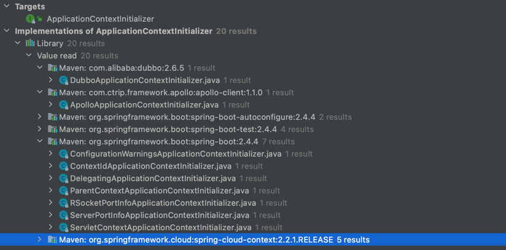

:toc:

PS: 以下流程来自 2.4.4 版本，其他版本大同小异！

== 一、spring boot 启动过程

=== 1.1 SpringApplication#run

SpringApplication#run 方法等同于 new SpringApplication(primarySources).run(args)

==== 1.1.1 new SpringApplication 过程

----
    public SpringApplication(ResourceLoader resourceLoader, Class<?>... primarySources) {
		// 这个字段一般为空
        this.resourceLoader = resourceLoader;
		Assert.notNull(primarySources, "PrimarySources must not be null");
		// 主资源类（一般就是启动类，即 SpringApplication#run 的参数）
		this.primarySources = new LinkedHashSet<>(Arrays.asList(primarySources));
        // 推断 WEB 类型（通过类路径上是否有对应的类来进行判断）
        // 例如存在 org.springframework.web.reactive.DispatcherHandler，则认为是 REACTIVE 类型
		this.webApplicationType = WebApplicationType.deduceFromClasspath();
        // 通过 spring.factories 机制加载 Bootstrapper
		this.bootstrappers = new ArrayList<>(getSpringFactoriesInstances(Bootstrapper.class));
        // 通过 spring.factories 机制加载 ApplicationContextInitializer
		setInitializers((Collection) getSpringFactoriesInstances(ApplicationContextInitializer.class));
        // 通过 spring.factories 机制加载 ApplicationListener
		setListeners((Collection) getSpringFactoriesInstances(ApplicationListener.class));
        // 通过堆栈中调用 main 方法的类推到出来
		this.mainApplicationClass = deduceMainApplicationClass();
	}
----

==== 1.1.2 Bootstrapper 引导程序

[%hardbreaks]
主要接口：
org.springframework.boot.Bootstrapper
org.springframework.boot.BootstrapRegistry

功能 +
通过下面的描述来看，主要是用来在spring上下文初始化前需要初始化的类。分析到后面的初始化流程的时候可以再观察一下。

________
A simple object registry that is available during startup and Environment post-processing up to the point that the ApplicationContext is prepared.
Can be used to register instances that may be expensive to create, or need to be shared before the ApplicationContext is available.
The registry uses Class as a key, meaning that only a single instance of a given type can be stored.
________

其生命周期仅存在于 spring 初始化阶段（refresh 前关闭），非对用户开放的 API！

==== 1.1.3 ApplicationContextInitializer 初始化

通过下面的描述来看，主要是提供了一个在 spring context refreshed 之前的回调接口，即：spring 会在上下文真正初始化之前进行调用。

________
Callback interface for initializing a Spring ConfigurableApplicationContext prior to being refreshed.
Typically used within web applications that require some programmatic initialization of the application context.
For example, registering property sources or activating profiles against the context's environment.
See ContextLoader and FrameworkServlet support for declaring a "contextInitializerClasses" context-param and init-param, respectively.
ApplicationContextInitializer processors are encouraged to detect whether Spring's Ordered interface has been implemented or if the @Order annotation is present and to sort instances accordingly if so prior to invocation.
________

上图中是典型的一些实现类。

----

/**
 * {@link ApplicationContextInitializer} for setting the servlet context.
 *
 * @author Dave Syer
 * @author Phillip Webb
 * @since 2.0.0
 */
public class ServletContextApplicationContextInitializer
		implements ApplicationContextInitializer<ConfigurableWebApplicationContext>, Ordered {

	private int order = Ordered.HIGHEST_PRECEDENCE;

	private final ServletContext servletContext;

	private final boolean addApplicationContextAttribute;

    // 这个的初始化一般和 ServletContainerInitializer 配合使用，由WEB容器回调 ServletContainerInitializer，则可以获取 ServletContext
	/**
	 * Create a new {@link ServletContextApplicationContextInitializer} instance.
	 * @param servletContext the servlet that should be ultimately set.
	 */
	public ServletContextApplicationContextInitializer(ServletContext servletContext) {
		this(servletContext, false);
	}

	/**
	 * Create a new {@link ServletContextApplicationContextInitializer} instance.
	 * @param servletContext the servlet that should be ultimately set.
	 * @param addApplicationContextAttribute if the {@link ApplicationContext} should be
	 * stored as an attribute in the {@link ServletContext}
	 * @since 1.3.4
	 */
	public ServletContextApplicationContextInitializer(ServletContext servletContext,
			boolean addApplicationContextAttribute) {
		this.servletContext = servletContext;
		this.addApplicationContextAttribute = addApplicationContextAttribute;
	}

	public void setOrder(int order) {
		this.order = order;
	}

	@Override
	public int getOrder() {
		return this.order;
	}

    // 将 applicationContext 和 servletContext 关联起来，这样两个上下文就可以互相访问了。
	@Override
	public void initialize(ConfigurableWebApplicationContext applicationContext) {
		applicationContext.setServletContext(this.servletContext);
		if (this.addApplicationContextAttribute) {
			this.servletContext.setAttribute(WebApplicationContext.ROOT_WEB_APPLICATION_CONTEXT_ATTRIBUTE,
					applicationContext);
		}

	}

}

public interface ServletContainerInitializer {

    /**
     * Receives notification during startup of a web application of the classes
     * within the web application that matched the criteria defined via the
     * {@link javax.servlet.annotation.HandlesTypes} annotation.
     *
     * @param c     The (possibly null) set of classes that met the specified
     *              criteria
     * @param ctx   The ServletContext of the web application in which the
     *              classes were discovered
     *
     * @throws ServletException If an error occurs
     */
    void onStartup(Set<Class<?>> c, ServletContext ctx) throws ServletException;
}
----

这个功能的加载整体还是通过 spring.factories 机制进行加载。其中 spring.boot 中默认生效的如下： 上面提到的ServletContextApplicationContextInitializer需要根据是否是WEB环境来动态判断是否启动，与这些静态的稍微不同。

----
# Application Context Initializers
org.springframework.context.ApplicationContextInitializer=\
org.springframework.boot.context.ConfigurationWarningsApplicationContextInitializer,\
org.springframework.boot.context.ContextIdApplicationContextInitializer,\
org.springframework.boot.context.config.DelegatingApplicationContextInitializer,\
org.springframework.boot.rsocket.context.RSocketPortInfoApplicationContextInitializer,\
org.springframework.boot.web.context.ServerPortInfoApplicationContextInitializer
----

1. ConfigurationWarningsApplicationContextInitializer +
其主要是通过 BeanDefinitionRegistryPostProcessor 增加了检测，当前只检测了扫描路径
* 扫描配置了有问题的路径，目前检测了org.springframework、org 两个包路径。目前主要写警告日志，不会发生阻断。
2. ContextIdApplicationContextInitializer +
其主要功能是创建一下Spring上下文的ContextId。
3. DelegatingApplicationContextInitializer +
通过属性 context.initializer.classes 加载其他的ApplicationContextInitializer，相当于提供了另外一种加载ApplicationContextInitializer的扩展方式。
4. RSocketPortInfoApplicationContextInitializer +
注册 RSocketServerInitializedEvent 的 ApplicationListener，感知 RSocketServer 端口设置到属性 server.ports 中。
5. ServerPortInfoApplicationContextInitializer +
注册 WebServerInitializedEvent 的 ApplicationListener，感知 WEB 的端口设置到属性 server.ports 中。

==== 1.1.4 ApplicationListener 初始化

ApplicationListener 主要是监听 ApplicationEvent 来做出响应，是观察者模式。其回调机制依赖于对应事件的发生。

----
/**
 * Interface to be implemented by application event listeners.
 *
 * 
Based on the standard {@code java.util.EventListener} interface
 * for the Observer design pattern.
 *
 * 
As of Spring 3.0, an {@code ApplicationListener} can generically declare
 * the event type that it is interested in. When registered with a Spring
 * {@code ApplicationContext}, events will be filtered accordingly, with the
 * listener getting invoked for matching event objects only.
 *
 * @author Rod Johnson
 * @author Juergen Hoeller
 * @param <E> the specific {@code ApplicationEvent} subclass to listen to
 * @see org.springframework.context.ApplicationEvent
 * @see org.springframework.context.event.ApplicationEventMulticaster
 * @see org.springframework.context.event.SmartApplicationListener
 * @see org.springframework.context.event.GenericApplicationListener
 * @see org.springframework.context.event.EventListener
 */
@FunctionalInterface
public interface ApplicationListener<E extends ApplicationEvent> extends EventListener {

	/**
	 * Handle an application event.
	 * @param event the event to respond to
	 */
	void onApplicationEvent(E event);

	/**
	 * Create a new {@code ApplicationListener} for the given payload consumer.
	 * @param consumer the event payload consumer
	 * @param <T> the type of the event payload
	 * @return a corresponding {@code ApplicationListener} instance
	 * @since 5.3
	 * @see PayloadApplicationEvent
	 */
	static <T> ApplicationListener<PayloadApplicationEvent<T>> forPayload(Consumer<T> consumer) {
		return event -> consumer.accept(event.getPayload());
	}

}
----

ApplicationListener （springboot 中默认加载的 ApplicationListener）

----
# Application Listeners
org.springframework.context.ApplicationListener=\
org.springframework.boot.ClearCachesApplicationListener,\
org.springframework.boot.builder.ParentContextCloserApplicationListener,\
org.springframework.boot.context.FileEncodingApplicationListener,\
org.springframework.boot.context.config.AnsiOutputApplicationListener,\
org.springframework.boot.context.config.DelegatingApplicationListener,\
org.springframework.boot.context.logging.LoggingApplicationListener,\
org.springframework.boot.env.EnvironmentPostProcessorApplicationListener,\
org.springframework.boot.liquibase.LiquibaseServiceLocatorApplicationListener
----

1. ClearCachesApplicationListener +
关注事件类型：ContextRefreshedEvent +
功能：清空反射的缓存、清空 classloader 的缓存(需要 classloader 实现 clearCache 方法)
2. ParentContextCloserApplicationListener +
监听事件类型：ParentContextAvailableEvent +
功能：在父类上下文中新注册一个监听器 ContextCloserListener （关注事件类型：ContextClosedEvent），这样当父上下文关闭的时候，也关闭一下当前上下文。
3. FileEncodingApplicationListener +
监听事件类型：ApplicationEnvironmentPreparedEvent +
功能：如果配置了 spring.mandatory-file-encoding 环境属性（自定义），则要求系统属性 file.encoding 与 spring.mandatory-file-encoding 的值相同！
4. AnsiOutputApplicationListener +
监听事件类型：ApplicationEnvironmentPreparedEvent +
功能：设置 AnsiOutput 的属性值
5. DelegatingApplicationListener +
监听事件类型: ApplicationEnvironmentPreparedEvent & ApplicationEvent +
功能: +
* 监听 ApplicationEnvironmentPreparedEvent，主要是根据属性 context.listener.classes 来加载自定义的 ApplicationListener
* 监听 ApplicationEvent，主要是将事件发送给上面加载的自定义的 ApplicationListener
6. LoggingApplicationListener +
监听事件类型： +
ApplicationStartingEvent +
ApplicationEnvironmentPreparedEvent +
ApplicationPreparedEvent +
ContextClosedEvent +
ApplicationFailedEvent +
功能：其主要监听的上下文生命周期的事件类型，联动处理 loggingSystem 的生命周期；
7. EnvironmentPostProcessorApplicationListener +
监听事件类型： +
ApplicationEnvironmentPreparedEvent +
ApplicationPreparedEvent +
ApplicationFailedEvent +
功能：+ 其主要监听的上下文生命周期的事件类型，联动调用 EnvironmentPostProcessor（EnvironmentPostProcessor 从 ConfigurableBootstrapContext 获取）；
8. LiquibaseServiceLocatorApplicationListener +
监听事件类型：ApplicationStartingEvent +
功能：执行 Liquibase 相关操作（通过判断类路径上是否存在 liquibase.servicelocator.CustomResolverServiceLocator 来决定是否启用）

=== 1.1.5 实例方法 run(String... args) 方法
构造好 SpringApplication 实例之后，需要调用其 run(String... args) 进行下一步的工作。
其主要流程如下所示，主要找其中的

----
public ConfigurableApplicationContext run(String... args) {
		// 1、创建并启动计时监控类
		StopWatch stopWatch = new StopWatch();
		stopWatch.start();

		// 2、DefaultBootstrapContext 初始化
		DefaultBootstrapContext bootstrapContext = createBootstrapContext();

		ConfigurableApplicationContext context = null;

		// 3、设置 java.awt.headless 属性，默认为 true
		configureHeadlessProperty();

		//4、创建所有 SpringApplication 运行监听器并发布应用启动事件
		SpringApplicationRunListeners listeners = getRunListeners(args);
		listeners.starting(bootstrapContext, this.mainApplicationClass);

		try {
			// 5、初始化默认应用参数类
			ApplicationArguments applicationArguments = new DefaultApplicationArguments(args);

			// 6、根据运行监听器和应用参数来准备 Spring 环境
			ConfigurableEnvironment environment = prepareEnvironment(listeners, bootstrapContext, applicationArguments);
			configureIgnoreBeanInfo(environment);

			// 7、创建 Banner 打印类
			Banner printedBanner = printBanner(environment);

			// 8、创建应用上下文
			context = createApplicationContext();
			context.setApplicationStartup(this.applicationStartup);

			// 9、准备应用上下文
			prepareContext(bootstrapContext, context, environment, listeners, applicationArguments, printedBanner);

			// 10、刷新应用上下文
			refreshContext(context);

			// 11、应用上下文刷新后置处理
			afterRefresh(context, applicationArguments);

			// 12、停止计时监控类并输出
			stopWatch.stop();
			if (this.logStartupInfo) {
				new StartupInfoLogger(this.mainApplicationClass).logStarted(getApplicationLog(), stopWatch);
			}

			// 13、发布应用上下文启动完成事件
			listeners.started(context);

			// 14、执行所有 Runner 运行器
			callRunners(context, applicationArguments);
		}
		catch (Throwable ex) {
			handleRunFailure(context, ex, listeners);
			throw new IllegalStateException(ex);
		}

		try {
			// 15、发布应用上下文就绪事件
			listeners.running(context);
		}
		catch (Throwable ex) {
			handleRunFailure(context, ex, null);
			throw new IllegalStateException(ex);
		}
		return context;
	}
----

* DefaultBootstrapContext 初始化 +
根据上面加载的 Bootstrapper 初始化 DefaultBootstrapContext。 +
可以将 DefaultBootstrapContext 理解为一个启动的 *辅助容器*。

* 设置 java.awt.headless 属性，默认为 true +
________
对于一个 Java 服务器来说经常要处理一些图形元素，例如地图的创建或者图形和图表等。这些API基本上总是需要运行一个X-server以便能使用AWT（Abstract Window Toolkit，抽象窗口工具集）。然而运行一个不必要的 X-server 并不是一种好的管理方式。有时你甚至不能运行 X-server,因此最好的方案是运行 headless 服务器，来进行简单的图像处理。 +
参考：www.cnblogs.com/princessd8251/p/4000016.html
________

* 创建应用上下文 +
目前支持3种类型的，
----
        ApplicationContextFactory DEFAULT = (webApplicationType) -> {
		try {
			switch (webApplicationType) {
			case SERVLET:
				return new AnnotationConfigServletWebServerApplicationContext();
			case REACTIVE:
				return new AnnotationConfigReactiveWebServerApplicationContext();
			default:
				return new AnnotationConfigApplicationContext();
			}
		}
		catch (Exception ex) {
			throw new IllegalStateException("Unable create a default ApplicationContext instance, "
					+ "you may need a custom ApplicationContextFactory", ex);
		}
	};
----

* 准备应用上下文 +
准备应用上下文是 springboot 的概念，在 SpringCore 中一般是直接指定了配置文件等，在 springboot 需要将自己和配置文件打通。 +
除去 spring.factories 之外，这一自动组装的功能应该是springboot的主要功能。
TODO
----
private void prepareContext(DefaultBootstrapContext bootstrapContext, ConfigurableApplicationContext context,
			ConfigurableEnvironment environment, SpringApplicationRunListeners listeners,
			ApplicationArguments applicationArguments, Banner printedBanner) {
		context.setEnvironment(environment);
		postProcessApplicationContext(context);
		applyInitializers(context);
		listeners.contextPrepared(context);
		bootstrapContext.close(context);
		if (this.logStartupInfo) {
			logStartupInfo(context.getParent() == null);
			logStartupProfileInfo(context);
		}
		// Add boot specific singleton beans
		ConfigurableListableBeanFactory beanFactory = context.getBeanFactory();
		beanFactory.registerSingleton("springApplicationArguments", applicationArguments);
		if (printedBanner != null) {
			beanFactory.registerSingleton("springBootBanner", printedBanner);
		}
		if (beanFactory instanceof DefaultListableBeanFactory) {
			((DefaultListableBeanFactory) beanFactory)
					.setAllowBeanDefinitionOverriding(this.allowBeanDefinitionOverriding);
		}
		if (this.lazyInitialization) {
			context.addBeanFactoryPostProcessor(new LazyInitializationBeanFactoryPostProcessor());
		}
		// Load the sources
		Set<Object> sources = getAllSources();
		Assert.notEmpty(sources, "Sources must not be empty");
		load(context, sources.toArray(new Object[0]));
		listeners.contextLoaded(context);
	}
----

* 刷新应用上下文 +
注册了 shutdownHook（用于监听shutdown的时候做上下文的关闭）+ Spring应用上下文刷新操作
----
	private void refreshContext(ConfigurableApplicationContext context) {
		if (this.registerShutdownHook) {
			try {
				context.registerShutdownHook();
			}
			catch (AccessControlException ex) {
				// Not allowed in some environments.
			}
		}
		refresh((ApplicationContext) context);
	}
----

* 应用上下文刷新后置处理 +
目前没有执行，只是保留了这个扩展点

* 执行所有 Runner 运行器 +
依次回调上下文中的 ApplicationRunner、CommandLineRunner Bean。

== 二、参考
[%hardbreaks]
TODO https://www.toutiao.com/i6843033073345364488/[当用SpringApplication.run的时候发生了什么(一)]
TODO https://www.toutiao.com/i6760252859201094148/[Springboot：高并发下耗时操作的实现]
TODO https://www.toutiao.com/i6839610818623963651/[Spring Boot深度实践之自动装配]
TODO https://www.toutiao.com/i6839241200394830347/[Spring Boot 在启动时进行配置文件加解密]
TODO https://www.toutiao.com/i6807650160445751820/[SpringBoot 线程池的使用]
TODO https://www.xiefayang.com/2019/04/01/Spring%20Boot%20%E9%85%8D%E7%BD%AE%E7%BB%91%E5%AE%9A%E6%BA%90%E7%A0%81%E8%A7%A3%E6%9E%90/[Spring Boot 2.0源码解析-配置绑定]
TODO https://segmentfault.com/a/1190000015998105[涨姿势：Spring Boot 2.x 启动全过程源码分析]